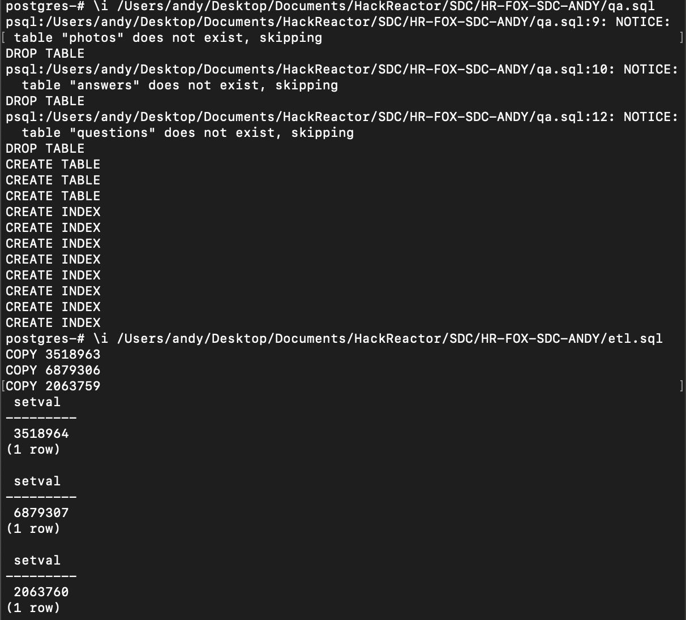
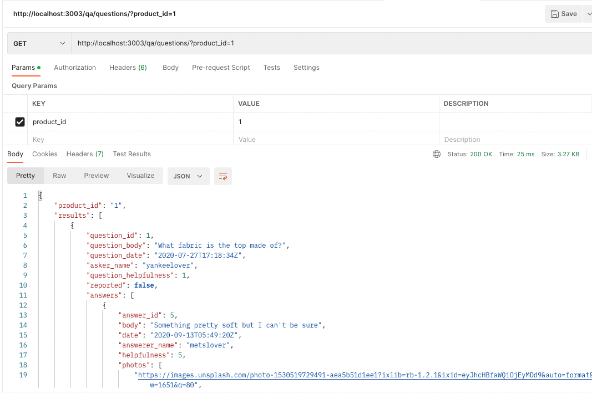

# HR-FOX-SDC-ANDY

for starters you have to create a data folder and then add or create csv files

run \i and the file path to qa.sql in database terminal to create the tables
run \i and the file path to etl.sql in database terminal to ETL data from CSV files

run npm run server-dev  to start up the server

update lines 16 and 18 in the index.js with your username and database for postgress, possibly adding a password key.

At this point the server should be working on port 3003 of local host. You can use this and the routes in the index to get the information needed. Updating the routes in the Front end Q&A routes to http://localhost:3003/(route) should allow for this database to be used for the Q&A section instread of the schools API. Since the product ID was hard coded in the front end for a presentation, that would most likely need to be edited.

Once the database is filled in the local database a file can be created to load the filled database onto an EC2 instance to be deployed.  Initial loader.io tests on the deployed instance meet the current needs of 1000rps with latency under 50ms and < 1% error rate. When I tried increasing the rps the latency started climbing quickly increasing 1000% at 2000rps and becoming too slow to complete the tests around 6700rps. In order to handle 2000 rps I deployed a load blancer using nginx to balance between two servers. While I was able to handle 2000 rps with less than 50ms latency, the error rate did start going up. To combat the error rate, and increase look ups, I added a cache to my load balancer. I could now handle 2000 rps with only 2ms latency, and the error rate was more manageable. When I tried going above 2000 rps, even adding a third instance to balance with, I started realizing the limitations of the free tier EC2 instance I was using. While the client should be set up for now, I have recomeneded putting some budget into a database should traffic continue to increase.